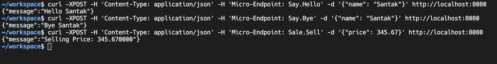

# microservice-using-golang

Go-micro is an open-source framework for building microservices in Go.

Features:
1. automated service discovery
1. synchronous and asynchronous communication patterns
1. client-side load balancing
1. event streaming 
1. integrated authentication mechanisms.

Run the app

```bash
go mod tidy
go run .
```

Run these command to verify the handlers in the application
```bash
curl -XPOST -H 'Content-Type: application/json' -H 'Micro-Endpoint: Say.Hello' -d '{"name": "Santak"}' http://localhost:8080

curl -XPOST -H 'Content-Type: application/json' -H 'Micro-Endpoint: Say.Bye' -d '{"name": "Santak"}' http://localhost:8080

curl -XPOST -H 'Content-Type: application/json' -H 'Micro-Endpoint: Sale.Sell' -d '{"price": 345.67}' http://localhost:8080
```

